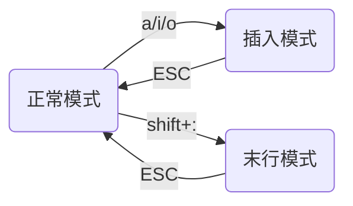

## Linux开发工具

[TOC]

### 💻  Linux安装软件

:apple:. 源代码安装

:apple:. rpm包安装

:apple:.yum命令行安装

### 💻  Linux软件包管理器yum 

:pear:yum是什么？

全称：Yellowdog Updater Modified

**一个解决依赖关系而存在的软件包管理器**

> 类比你手机里的应用商店的一键安装
>
> yum源：~~还没学服务器，自己也没怎么理解清楚，有大佬看到可以在帮忙解释下，:🥺~~
>
> 按我现在的理解：类似于一个库，里面放着很多软件包的路径，yum安装软件的过程就是从库里检索路径然后安装的过程。

:pear: lszrz

作用：让Windows和Linux的文件可以进行交互

:pear: yum list

列出所有可安装的安装包

> 这个时候你会看到很多东西，举个例子，下面是其中一条信息
>
> zvbi-devel.x86_64                                                         0.2.35-1.el7                                                          epel  
>
> 软件包名       机器位数                                                   软件的版本 ; el7单独解释                               软件源             
>
> x86_64:适用于64位的系统        i686表示32位的
>
> el7：操作系统的发行版本是Centos7/redhat7         el7表示Centos6/redhat6
>
> epel：这一列表示软件源,这里的epel就是指扩展源，类似于应用商店的概念           

:pear: yum list installed

列出所有已安装的安装包

:pear: 查找1：yum list|grep  +过滤的信息

> 利用管道搜索

:pear: 查找2：yum search +关键字

>从yum源查找所有与关键字相关的软件包

:pear: 安装：sudo yum install  +软件包名

> 例：sudo yum install sl 
>
> sudo yum install **-y** sl
>
> ==-y==表示安装时不再询问，全部yes
>
> 这里的sl就是一个包名，也就是经典的小火车
>
> 
>
> **注：这里录屏只录了半个屏幕，所以小火车没有立即出现，快去试试吧！**
>
> sudo提升权限到root

> **扩展：**百度Centos7中好玩的指令，会有很多类似小火车一样的软件包

:pear: 卸载：sudo yum remove +软件包名

> 例：sudo yum remove sl

:pear: 更新yum源  yum -y update

> 报错就sudo提升一下权限

扩展源

:pear: yum repolist enabled

列出所有可用的yum仓库

> 英文时间:arrow_up_down:：repolist==repository list    

:pear: yum repolist all

列出所有的yum仓库

### 💻Linux编辑器-vim的使用

:pear: 文件的打开和退出

> 常用的打开和关闭:
>
> vim+文件名   打开文件
>
> **: + q** 不保存并退出
>
> **: + wq** 保存并退出
>
> : + q！强制退出
>
> : + wq! 强制保存并退出
>
> :+ w! 强制保存
>
> **注:冒号是英文的**

正常模式：vim进去默认就是正常模式

末行模式: 底下出现出现:(英文冒号）就是末行模式

> 冒号进行的操作都是在底下输入的

插入模式：界面出现---INSERT---字样

**三种模式的切换如图所示**

> gif动图演示如下
>
> **注:行号要自己配置**
>
> 

:pear: 字母a、i、o  都可以==进入插入模式==，但是有一点细小的区别，就是开始时光标出现的位置，这里不展开讲。

####🍉普通模式

:pear: h j k l ==按字符为单位==，光标往  左 下 上 右 移动

> 我们习惯用: ⬅➡⬆⬇这四个箭头控制光标
>
> **vim文本编辑器里更推荐用 h j k l 表示左 下 上 右 四个方向**
>
> **可以打开自己的Linux试一试，开始肯定会很不习惯**

> ==帮助记忆==：h和l在键盘上的分布：h在左，l在右，所以分别代表左右，j表示jump，往下跳，所以 j 表示往下，k 表示king，king高高在上，所以是向上的
>
> ⬅= =h        ➡= =l
>
> ⬆= =k        ⬇= =j

:pear: w  ==按单词为单位==  光标向后移动

> 

:pear: b  ==按单词为单位==  光标向前移动

> 

:pear: shift+4  ($)   锚点  ==跳到行尾==

> 

:pear: shift+6 (^)   锚点  ==跳到行首==

>
>
>

:pear: shift+g 或者 G  ==定位到文件末尾== 

> 文件有上千行代码 得直接翻到最后怎么办
>
> 注: shift+g的值就等于G

:pear: gg  ==定位到文件开头==

> 文件有上千行代码 得回到开头怎么办
>
> gg即可

:pear: num+shift+g==定位到任意一行==    

>比如  9+shift+g直接跳到第九行

:pear: num+yy   num+p  ==复制粘贴==

>   **yy表示复制   p表示粘贴**
>
> | yy  p   | 复制1行   粘贴1次  |
> | ------- | ------------------ |
> | 5yy p   | 复制5行   粘贴1次  |
> | yy 100p | 复制1行  粘贴100次 |

> 复制粘贴gif演示 ：
>
> 

:pear: num+dd   num+p  ==剪切粘贴==

> **dd 表示剪切当前行，相当于删除**
>
> **p表示粘贴**
>
> | dd  p   | 剪切1行 粘贴1次   |
> | ------- | ----------------- |
> | 5dd p   | 剪切5行 粘贴1次   |
> | dd 100p | 剪切1行 粘贴100次 |
> | dd      | 剪切1行==删除改行 |
>
> 
>
> 删除和剪切gif演示:
>
> 

:pear: num+r  ==替换num个字符==    

> r+a   相当于把当前字符替换成a
>
> 5+r+a 相当于把五个字符替换成a
>
> 

:pear: shift+r  ==替换模式== 整体文本替换

> 进入替换模式  可以一直替换
>
> ESC退出

:pear: shift+`(~)  ==大小写切换==

> 按住
>
> 

:pear: x  ==删除字符==  

> 删除光标所在的字符

:pear: num+x   ==向左删除num个字符==

> 一次性删num个字符

:pear: shift+x ==向右删除字符==

> shift+x==X; 往右删，也就是往回删

:pear: u  ==**撤销**==

> 相当于我们经常用的ctrl+z

:pear: ctrl+r ==撤销撤销操作==

> 相当于撤销上一次的撤销操作

:pear:  ctrl+b  ==翻到前一页==

> 代码太多按页翻

:pear: ctrl+f  ==翻到后一页==

>代码太多按页翻

:pear: yw  ==复制一个单词==

> yy是复制一整行，yw是复制一个单词
>
> yw的w可理解为word

:pear: dw ==删除一个单词==

> dd是删除一整行  dw是删除一个单词
>
> dw的w可理解为word

:pear: shift+3 ==查找==

> shift+3就是#

:pear: ?关键字  和/关键字  ==文本内查找关键字==

> 比如 ?printf  和 /printf 都是在查找printf

#### 🍉末行模式

:pear:  :w! ==强制保存== 

:pear:  :wq!  ==强制保存并退出==

:pear:  :%s/关键字1/关键字2/g   把关键字1==批量化替换==为关键字2

> **演示时注意文件末尾输入的命令**
>
> 

:pear:  :==!==gcc test.c    ==!==ls -al  可以执行文件外的命令

> q!是强制退出   !q不是，两个得区分
>
> ’ ! ‘ 放在前面可以在当前目录下进行gcc、ls之类本应该在外面进行的操作

:pear: : vs 文件名 ==分屏操作==

> 比如 test1.c 就分一个test1.c的屏 

:pear: ctrl+w+w  ==切屏==

> **注：w要按两下**

> 切屏和执行文件外面的命令演示：
>
> 

#### 🍉vim配置

:watermelon:

百度vim常见配置就可以

> 提醒几点：
>
> 1. 别在root下改，改了后你可能就回不来了
>
> 2. 建议先建一个临时用户试试 
>
>    ~~我就是玩崩了，调了很久才调回去~~

